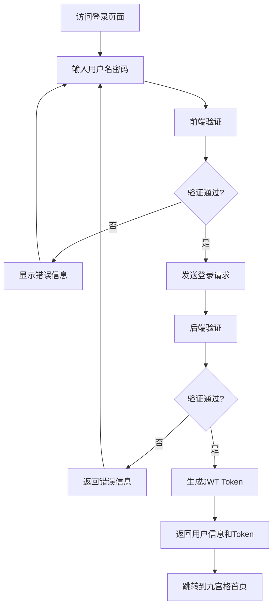
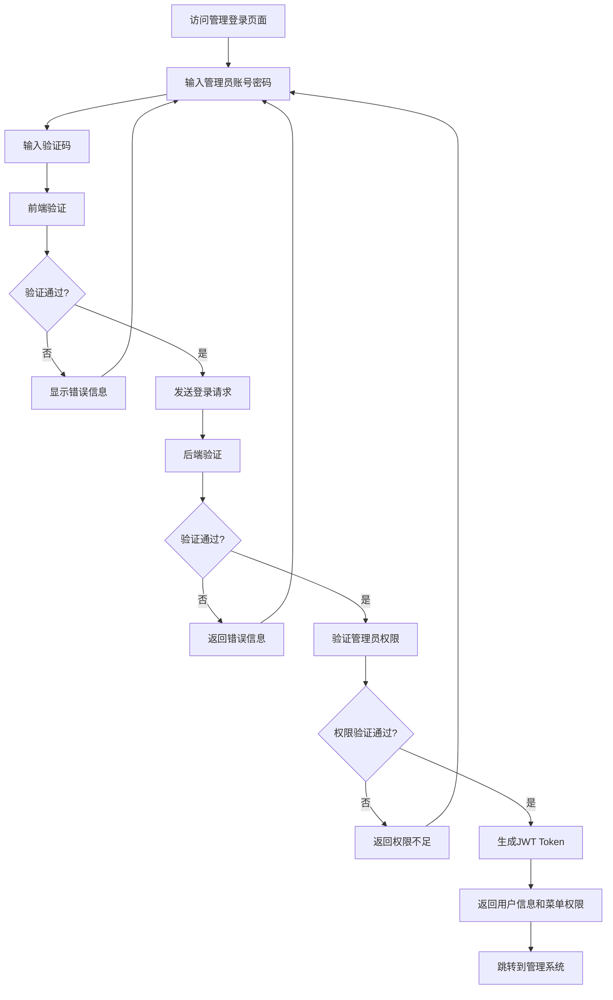

# 眼科检查系统项目需求说明书

## 项目概述

**项目名称**: 眼科检查系统 (Eye Examination System)  
**版本**: 1.0  
**编写日期**: 2024年12月7日  
**项目类型**: 前后端分离的Web应用系统  

### 项目背景
眼科检查系统是一个面向眼科医院和诊所的综合管理平台，旨在提供患者管理、检查记录、报告生成等功能，提高医疗服务效率和质量。

### 项目目标
1. **提高工作效率**: 通过数字化管理，减少纸质记录，提高医务人员工作效率
2. **规范管理流程**: 建立标准化的患者管理和检查流程
3. **数据安全**: 确保患者数据的安全性和隐私保护
4. **用户体验**: 提供简洁、易用的用户界面

---

## 系统架构

### 技术栈
- **前端**: Vue 3 + Element Plus + Vite
- **后端**: Spring Boot + Spring Security + MyBatis Plus
- **数据库**: MySQL 8.0 + Redis 7.0
- **部署**: Docker + Docker Compose

### 系统分层
```
┌─────────────────────────────────────────────────────────────┐
│                    前端展示层 (Vue 3)                        │
├─────────────────────────────────────────────────────────────┤
│                    后端服务层 (Spring Boot)                  │
├─────────────────────────────────────────────────────────────┤
│                    数据访问层 (MyBatis Plus)                │
├─────────────────────────────────────────────────────────────┤
│                    数据存储层 (MySQL + Redis)               │
└─────────────────────────────────────────────────────────────┘
```

---

## 核心功能模块

### 1. 用户认证与授权
- **双入口登录系统**
- **角色权限管理**
- **JWT Token认证**

### 2. 患者管理
- **患者基本信息管理**
- **病史记录管理**
- **患者档案查询**

### 3. 眼部检查
- **检查项目配置**
- **检查记录管理**
- **检查报告生成**

### 4. 系统管理
- **用户管理**
- **权限管理**
- **系统配置**

---

## 功能详细需求

## 1. 登录功能 (核心功能)

### 1.1 功能概述
登录功能是系统的入口，支持双入口设计，满足不同用户角色的使用需求。

### 1.2 登录入口设计

#### 1.2.1 前端业务登录
**目标用户**: 医生、护士、技师等医务人员  
**访问路径**: `/login` 或 `/business-login`  
**功能特点**: 面向业务操作，界面简洁，操作便捷

**页面设计**:
```
┌─────────────────────────────────────────────────┐
│                 眼科检查系统                      │
│                                                │
│  ┌─────────────────────────────────────────┐    │
│  │             用户登录                     │    │
│  │                                        │    │
│  │  用户名: [___________________]          │    │
│  │                                        │    │
│  │  密码:   [___________________]          │    │
│  │                                        │    │
│  │  [ ] 记住密码                           │    │
│  │                                        │    │
│  │           [登录]  [重置]                │    │
│  │                                        │    │
│  │  忘记密码？ | 管理员登录                 │    │
│  └─────────────────────────────────────────┘    │
└─────────────────────────────────────────────────┘
```

**登录后界面 - 九宫格首页**:
```
┌─────────────────────────────────────────────────────────────┐
│  眼科检查系统                          [用户名] [退出]        │
├─────────────────────────────────────────────────────────────┤
│                                                            │
│                      功能导航                               │
│                                                            │
│    ┌─────────────┐    ┌─────────────┐    ┌─────────────┐    │
│    │             │    │             │    │             │    │
│    │  👤 患者管理  │    │  👁️ 眼部检查  │    │  ❓ 帮助说明  │    │
│    │             │    │             │    │             │    │
│    │  Patient    │    │  Eye Exam   │    │  Help Doc   │    │
│    │  Management │    │  Management │    │  Management │    │
│    │             │    │             │    │             │    │
│    └─────────────┘    └─────────────┘    └─────────────┘    │
│                                                            │
│    ┌─────────────┐    ┌─────────────┐    ┌─────────────┐    │
│    │             │    │             │    │             │    │
│    │  [预留功能]   │    │  [预留功能]   │    │  [预留功能]   │    │
│    │             │    │             │    │             │    │
│    │             │    │             │    │             │    │
│    │             │    │             │    │             │    │
│    │             │    │             │    │             │    │
│    └─────────────┘    └─────────────┘    └─────────────┘    │
│                                                            │
│    ┌─────────────┐    ┌─────────────┐    ┌─────────────┐    │
│    │             │    │             │    │             │    │
│    │  [预留功能]   │    │  [预留功能]   │    │  [预留功能]   │    │
│    │             │    │             │    │             │    │
│    │             │    │             │    │             │    │
│    │             │    │             │    │             │    │
│    │             │    │             │    │             │    │
│    └─────────────┘    └─────────────┘    └─────────────┘    │
│                                                            │
└─────────────────────────────────────────────────────────────┘
```

**功能说明**:
- **患者管理**: 患者信息录入、查询、编辑、档案管理
- **眼部检查**: 检查项目录入、检查记录、报告生成
- **帮助说明**: 系统使用说明、常见问题、操作指南

#### 1.2.2 后端管理登录
**目标用户**: 系统管理员、高级管理人员  
**访问路径**: `/admin-login` 或 `/management-login`  
**功能特点**: 面向系统管理，功能全面，权限严格

**页面设计**:
```
┌─────────────────────────────────────────────────┐
│                管理系统登录                       │
│                                                │
│  ┌─────────────────────────────────────────┐    │
│  │           管理员登录                     │    │
│  │                                        │    │
│  │  管理员账号: [___________________]       │    │
│  │                                        │    │
│  │  登录密码:   [___________________]       │    │
│  │                                        │    │
│  │  验证码:     [______]  [图片验证码]      │    │
│  │                                        │    │
│  │  [ ] 记住登录状态                       │    │
│  │                                        │    │
│  │           [登录系统]  [重置]             │    │
│  │                                        │    │
│  │  业务系统登录                           │    │
│  └─────────────────────────────────────────┘    │
└─────────────────────────────────────────────────┘
```

**登录后界面 - 管理系统**:
```
┌─────────────────────────────────────────────────────────────┐
│  管理系统                                [管理员] [退出]      │
├─────────────────────────────────────────────────────────────┤
│              │                                              │
│   系统管理    │                                              │
│   ├─ 用户管理  │                    主要内容区域                 │
│   ├─ 角色管理  │                                              │
│   ├─ 菜单管理  │                                              │
│   └─ 部门管理  │                                              │
│              │                                              │
│   眼科检查    │                                              │
│   ├─ 患者管理  │                                              │
│   ├─ 检查项目  │                                              │
│   ├─ 检查记录  │                                              │
│   └─ 检查报告  │                                              │
│              │                                              │
│   系统配置    │                                              │
│   ├─ 参数设置  │                                              │
│   ├─ 字典管理  │                                              │
│   └─ 日志管理  │                                              │
│              │                                              │
└─────────────────────────────────────────────────────────────┘
```

### 1.3 登录流程设计

#### 1.3.1 前端业务登录流程


#### 1.3.2 后端管理登录流程


### 1.4 技术实现要求

#### 1.4.1 前端技术要求
- **Vue 3 Composition API**: 使用最新的组合式API
- **Element Plus**: 使用Element Plus组件库
- **Vue Router**: 实现路由守卫和权限控制
- **Pinia**: 状态管理，存储用户信息和权限
- **Axios**: HTTP请求拦截器，自动添加Token

#### 1.4.2 后端技术要求
- **Spring Security**: 实现认证和授权
- **JWT**: 生成和验证Token
- **BCrypt**: 密码加密存储
- **Redis**: 缓存用户会话信息
- **MyBatis Plus**: 数据库操作

#### 1.4.3 安全要求
- **密码加密**: 使用BCrypt加密存储
- **Token过期**: JWT Token设置过期时间
- **重复登录**: 支持踢出已登录用户
- **登录日志**: 记录登录时间、IP地址等
- **失败次数限制**: 连续登录失败限制

### 1.5 数据库设计

#### 1.5.1 用户表 (sys_user)
```sql
CREATE TABLE sys_user (
    user_id BIGINT PRIMARY KEY AUTO_INCREMENT COMMENT '用户ID',
    username VARCHAR(50) UNIQUE NOT NULL COMMENT '用户名',
    password VARCHAR(100) NOT NULL COMMENT '密码',
    nickname VARCHAR(50) COMMENT '昵称',
    real_name VARCHAR(50) COMMENT '真实姓名',
    email VARCHAR(100) COMMENT '邮箱',
    phone VARCHAR(20) COMMENT '手机号',
    avatar VARCHAR(255) COMMENT '头像',
    user_type TINYINT DEFAULT 1 COMMENT '用户类型：1业务用户，2管理员',
    status TINYINT DEFAULT 1 COMMENT '状态：1启用，0禁用',
    login_ip VARCHAR(50) COMMENT '最后登录IP',
    login_date DATETIME COMMENT '最后登录时间',
    create_time DATETIME DEFAULT CURRENT_TIMESTAMP COMMENT '创建时间',
    update_time DATETIME DEFAULT CURRENT_TIMESTAMP ON UPDATE CURRENT_TIMESTAMP COMMENT '更新时间'
);
```

#### 1.5.2 登录日志表 (sys_logininfor)
```sql
CREATE TABLE sys_logininfor (
    info_id BIGINT PRIMARY KEY AUTO_INCREMENT COMMENT '访问ID',
    user_name VARCHAR(50) DEFAULT '' COMMENT '用户账号',
    user_type TINYINT DEFAULT 1 COMMENT '用户类型：1业务用户，2管理员',
    ipaddr VARCHAR(50) DEFAULT '' COMMENT '登录IP地址',
    login_location VARCHAR(255) DEFAULT '' COMMENT '登录地点',
    browser VARCHAR(50) DEFAULT '' COMMENT '浏览器类型',
    os VARCHAR(50) DEFAULT '' COMMENT '操作系统',
    status CHAR(1) DEFAULT '0' COMMENT '登录状态：0成功，1失败',
    msg VARCHAR(255) DEFAULT '' COMMENT '提示消息',
    login_time DATETIME DEFAULT CURRENT_TIMESTAMP COMMENT '访问时间'
);
```

### 1.6 API接口设计

#### 1.6.1 业务登录接口
```http
POST /api/auth/business-login
Content-Type: application/json

{
    "username": "doctor",
    "password": "123456",
    "rememberMe": true
}

Response:
{
    "code": 200,
    "msg": "登录成功",
    "data": {
        "token": "eyJhbGciOiJIUzI1NiJ9...",
        "user": {
            "userId": 1,
            "username": "doctor",
            "nickname": "医生",
            "userType": 1,
            "avatar": ""
        }
    }
}
```

#### 1.6.2 管理登录接口
```http
POST /api/auth/admin-login
Content-Type: application/json

{
    "username": "admin",
    "password": "123456",
    "captcha": "1234",
    "uuid": "uuid-1234"
}

Response:
{
    "code": 200,
    "msg": "登录成功",
    "data": {
        "token": "eyJhbGciOiJIUzI1NiJ9...",
        "user": {
            "userId": 1,
            "username": "admin",
            "nickname": "管理员",
            "userType": 2,
            "avatar": ""
        },
        "menus": [
            {
                "menuId": 1,
                "menuName": "系统管理",
                "children": [...]
            }
        ]
    }
}
```

### 1.7 页面路由设计

#### 1.7.1 前端路由配置
```javascript
// router/index.js
const routes = [
    {
        path: '/login',
        name: 'BusinessLogin',
        component: () => import('@/views/login/BusinessLogin.vue'),
        meta: { title: '业务登录', requiresAuth: false }
    },
    {
        path: '/admin-login',
        name: 'AdminLogin',
        component: () => import('@/views/login/AdminLogin.vue'),
        meta: { title: '管理登录', requiresAuth: false }
    },
    {
        path: '/',
        name: 'BusinessDashboard',
        component: () => import('@/views/dashboard/BusinessDashboard.vue'),
        meta: { title: '业务首页', requiresAuth: true, userType: 1 }
    },
    {
        path: '/admin',
        name: 'AdminDashboard',
        component: () => import('@/views/dashboard/AdminDashboard.vue'),
        meta: { title: '管理首页', requiresAuth: true, userType: 2 }
    }
];
```

#### 1.7.2 路由守卫
```javascript
// router/index.js
router.beforeEach((to, from, next) => {
    const token = getToken();
    const userType = getUserType();
    
    // 检查是否需要登录
    if (to.meta.requiresAuth && !token) {
        next('/login');
        return;
    }
    
    // 检查用户类型权限
    if (to.meta.userType && to.meta.userType !== userType) {
        next('/403');
        return;
    }
    
    next();
});
```

### 1.8 用户体验设计

#### 1.8.1 响应式设计
- 支持PC端、平板、手机端访问
- 九宫格布局自适应不同屏幕尺寸
- 管理系统支持侧边栏收缩

#### 1.8.2 交互设计
- 登录表单验证实时反馈
- 登录按钮防重复点击
- 加载状态显示
- 错误信息友好提示

#### 1.8.3 无障碍设计
- 键盘导航支持
- 屏幕阅读器支持
- 高对比度模式支持

### 1.9 测试用例

#### 1.9.1 业务登录测试
- [ ] 正确用户名密码登录成功
- [ ] 错误用户名提示用户不存在
- [ ] 错误密码提示密码错误
- [ ] 账号被禁用提示账号已禁用
- [ ] 记住密码功能正常
- [ ] 登录成功跳转到九宫格首页

#### 1.9.2 管理登录测试
- [ ] 管理员账号登录成功
- [ ] 验证码验证功能正常
- [ ] 非管理员账号无法登录
- [ ] 登录成功跳转到管理系统
- [ ] 菜单权限控制正常

### 1.10 部署要求

#### 1.10.1 环境要求
- Node.js 16+
- JDK 8+
- MySQL 8.0+
- Redis 7.0+
- Docker 20.10+

#### 1.10.2 性能要求
- 登录响应时间 < 2秒
- 并发用户数 > 100
- 系统可用性 > 99.9%

---

## 项目计划

### 开发阶段
1. **第一阶段** (1-2周): 登录功能开发
2. **第二阶段** (2-3周): 患者管理功能
3. **第三阶段** (2-3周): 眼部检查功能
4. **第四阶段** (1-2周): 系统管理功能
5. **第五阶段** (1周): 系统测试和优化

### 里程碑
- **M1**: 登录功能完成，支持双入口登录
- **M2**: 患者管理功能完成
- **M3**: 眼部检查功能完成
- **M4**: 系统管理功能完成
- **M5**: 系统上线

---

## 风险评估

### 技术风险
- **前后端分离**: 需要考虑跨域、Token管理等问题
- **权限控制**: 双入口权限控制复杂度较高
- **数据安全**: 医疗数据安全要求严格

### 解决方案
- 使用成熟的技术栈和框架
- 详细的权限设计和测试
- 加密传输和存储敏感数据

---

## 附录

### A. 默认测试账号
| 用户名 | 密码 | 类型 | 说明 |
|--------|------|------|------|
| doctor | 123456 | 业务用户 | 医生账号 |
| nurse | 123456 | 业务用户 | 护士账号 |
| technician | 123456 | 业务用户 | 技师账号 |
| admin | 123456 | 管理员 | 系统管理员 |

### B. 相关文档
- 技术架构设计文档
- API接口文档
- 数据库设计文档
- 部署手册

---

**文档版本**: 1.0  
**最后更新**: 2024年12月7日  
**审核状态**: 待审核 